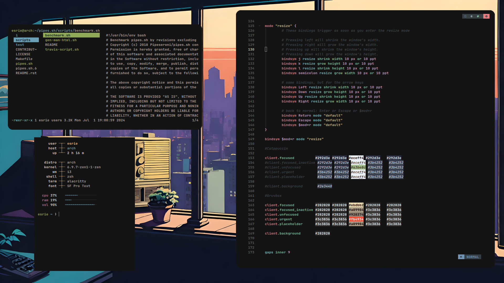

## BSPWM

 
## I3WM

If you don't know what you're doing, this might be helpful  https://esriee.github.io/posts/install-bspwm

These configurations reflect my personal settings. modify them to match your style and setup.
 
